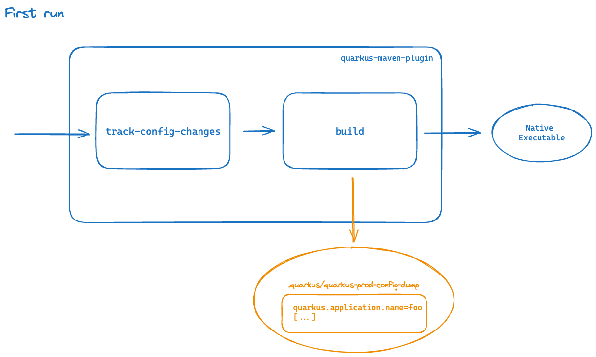
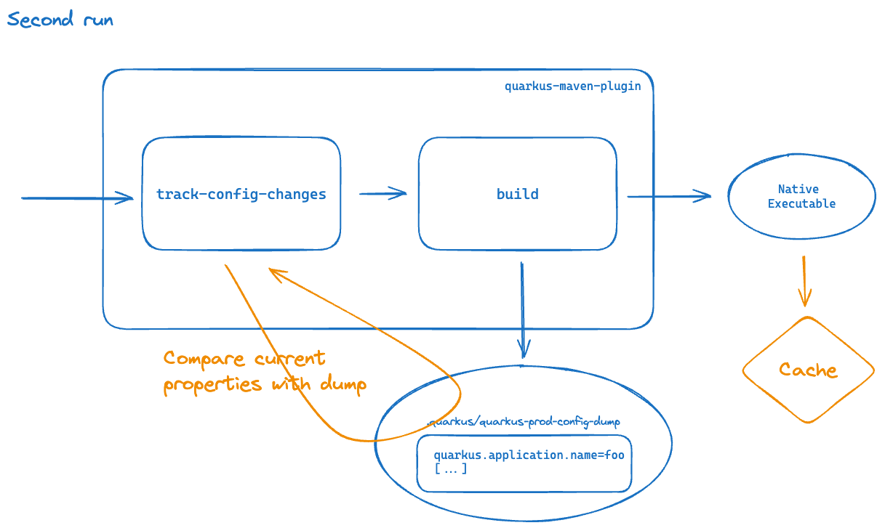
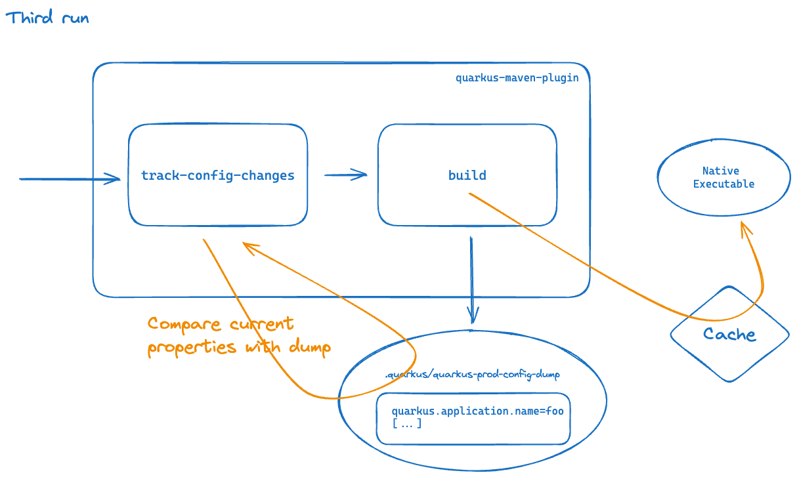

# Custom Maven Extension to make Quarkus build goal cacheable
This Maven extension allows to make the [Quarkus Maven plugin](https://quarkus.io/guides/quarkus-maven-plugin) `build` goal cacheable.

This project performs programmatic configuration of the [Develocity Build Cache](https://docs.gradle.com/develocity/maven-extension/current/#using_the_build_cache) through a Maven extension. See [here](https://docs.gradle.com/develocity/maven-extension/current/#custom_extension) for more details.

*Note:*<br>
A native executable can be a very large file. Copying it from/to the local cache, or transferring it from/to the remote cache can be an expensive operation that has to be balanced with the duration of the work being avoided.

## Requirements
Quarkus 3.2.4 and above which brings [track-config-changes goal](https://quarkus.io/guides/config-reference#tracking-build-time-configuration-changes-between-builds)

> [!NOTE]  
> Although Quarkus 3.2.4 is required, 3.9.0 and above is recommended as it exposes [Quarkus extra dependencies](#quarkus-extra-dependencies) which is added as extra input by the current extension.
> 
> This additional input is necessary when using snapshot versions (or when overwriting fixed version) of
> - The Quarkus dependencies
> - A custom Quarkus extension

## Limitations

### Supported package types
Only the `native`, `uber-jar`, `jar` and `legacy-jar` [packaging types](https://quarkus.io/guides/maven-tooling#quarkus-package-pkg-package-config_quarkus.package.type) can be made cacheable

### Build strategy
By default, the `native` packaging is cacheable only if the in-container build strategy (`quarkus.native.container-build=true`) is configured along with a fixed build image (`quarkus.native.builder-image`).
The in-container build strategy means the build is as reproducible as possible. Even so, some timestamps and instruction ordering may be different even when built on the same system in the same environment.

If the build environments are strictly identical, this restriction can be removed by setting `DEVELOCITY_QUARKUS_NATIVE_BUILD_IN_CONTAINER_REQUIRED=false`. See [configuration section](#build-strategy-1) for more details.

> [!NOTE]
> When the in-container build strategy is used as a fallback the caching feature will be disabled. The fallback may happen due to GraalVM requirements not met. The recommendation is to explicitly set the in-container strategy (`quarkus.native.container-build=true`) to benefit from caching

## Usage

### Extension declaration

Reference the extension in `.mvn/extensions.xml` (this extension requires the develocity-maven-extension):

```xml
<extensions>
    <extension>
        <groupId>com.gradle</groupId>
        <artifactId>develocity-maven-extension</artifactId>
        <version>1.23</version>
    </extension>
    <extension>
        <groupId>com.gradle</groupId>
        <artifactId>quarkus-build-caching-extension</artifactId>
        <version>1.8</version>
    </extension>
</extensions>
```

Note on the Compatibility with The Develocity extension:

| Extension                                      | Compatible version |
|------------------------------------------------|--------------------|
| `com.gradle:develocity-maven-extension`        | 1.+                |
| `com.gradle:gradle-enterprise-maven-extension` | 0.12               |

### The `quarkus-maven-plugin` configuration

Enable [Quarkus config tracking](https://quarkus.io/guides/config-reference#dumping-build-time-configuration-options-read-during-the-build) in `pom.xml`:

```xml
<properties>
    <quarkus.config-tracking.enabled>true</quarkus.config-tracking.enabled>
</properties>
```

Add the `track-prod-config-changes` execution to the `quarkus-maven-plugin` configuration:

```xml
<plugin>
    <groupId>${quarkus.platform.group-id}</groupId>
    <artifactId>quarkus-maven-plugin</artifactId>
    <version>${quarkus.platform.version}</version>
    <extensions>true</extensions>
    <executions>
        <execution>
            <id>track-prod-config-changes</id>
            <phase>process-resources</phase>
            <goals>
                <goal>track-config-changes</goal>
            </goals>
            <configuration>
                <dumpCurrentWhenRecordedUnavailable>true</dumpCurrentWhenRecordedUnavailable>
            </configuration>
        </execution>
        <execution>
            <goals>
                <goal>build</goal>
                <goal>generate-code</goal>
                <goal>generate-code-tests</goal>
            </goals>
        </execution>
    </executions>
</plugin>
```

### Quarkus configuration dump initialization

After applying the quarkus-maven-plugin [configuration step](#quarkus-maven-plugin-configuration), invoke the Quarkus `build` goal to generate the `.quarkus/quarkus-prod-config-dump` file.
This file is required to make the Quarkus `build` goal cacheable.

The file should be checked-in to the source code repository.
in continuous integration environment, an alternative is to have the file restored (see [this option](https://github.com/marketplace/actions/cache#restoring-and-saving-cache-using-a-single-action) for GitHub actions as an example).

If the file has some system dependent properties, it is possible to have [different configuration dump](#quarkus-configuration-dump) to reflect those changes (local, ci, os...) conditionally enabled by Maven profiles. 

It is also possible to [ignore properties](#ignore-properties-in-quarkus-configuration-dump) not impacting the produced artifacts. 
The `quarkus.native.graalvm-home` and `quarkus.native.java-home` are some classic examples, the JDK version is already captured as a goal input and the path to the JDK does not impact the produced artifact.

## Configuration

Configuration can be set with (listed in order of precedence ):
- [Environment variables](#environment-variables)
- [Maven properties](#maven-properties)
- [Configuration file](#configuration-file)

### Environment variables

#### Feature toggle

The caching can be disabled by setting:
```properties
DEVELOCITY_QUARKUS_CACHE_ENABLED=false
```

#### Quarkus configuration dump

By default, the values below are used to compute the dump-config (`.quarkus/quarkus-prod-config-dump`) and
config-check (`target/quarkus-prod-config-check`) file names:
- _build profile_: prod
- _file prefix_: quarkus
- _file suffix_: config-dump

Those values can be overridden, when CI and local have different Quarkus properties for instance:
```properties
DEVELOCITY_QUARKUS_BUILD_PROFILE=prod
DEVELOCITY_QUARKUS_DUMP_CONFIG_PREFIX=quarkus
DEVELOCITY_QUARKUS_DUMP_CONFIG_SUFFIX=config-dump-ci
```

#### Extra outputs

Some additional outputs can be configured if necessary (when using the [quarkus-helm](https://quarkus.io/blog/quarkus-helm/#getting-started-with-the-quarkus-helm-extension) extension for instance). The paths are relative to the `target` folder.

Directories can be added (csv list):
```properties
DEVELOCITY_QUARKUS_KEY_EXTRA_OUTPUT_DIRS=helm
```
or Specific files (csv list):
```properties
DEVELOCITY_QUARKUS_KEY_EXTRA_OUTPUT_FILES=helm/kubernetes/my-project/Chart.yaml,helm/kubernetes/my-project/values.yaml
```

#### Build strategy

The default is to enable caching only when the in-container build strategy is used. 
If the build environments are strictly identical build over build, the restriction can be removed by setting:
```properties
DEVELOCITY_QUARKUS_NATIVE_BUILD_IN_CONTAINER_REQUIRED=false
```

### Maven properties

The same configuration can be achieved with Maven properties:
```xml
<properties>
    <develocity.quarkus.cache.enabled>true</develocity.quarkus.cache.enabled>
    <develocity.quarkus.build.profile>prod</develocity.quarkus.build.profile>
    <develocity.quarkus.dump.config.prefix>quarkus</develocity.quarkus.dump.config.prefix>
    <develocity.quarkus.dump.config.suffix>config-dump-ci</develocity.quarkus.dump.config.suffix>
    <develocity.quarkus.extra.output.dirs>helm</develocity.quarkus.extra.output.dirs>
    <develocity.quarkus.extra.output.files>helm/kubernetes/${project.artifactId}/Chart.yaml,helm/kubernetes/${project.artifactId}/values.yaml</develocity.quarkus.extra.output.files>
    <develocity.quarkus.native.build.in.container.required>false</develocity.quarkus.native.build.in.container.required>
</properties>
```

### Configuration file

A configuration file can be used instead by defining its location (relative to the project root folder) either:
- as an environment variable:
`DEVELOCITY_QUARKUS_CONFIG_FILE=.quarkus/develocity-ci.properties`
- as a maven property:
`<develocity.quarkus.config.file>.quarkus/extension-local.properties</develocity.quarkus.config.file>`

Its content can be created like described in the [environment variables](#environment-variables) section.

### Ignore properties in Quarkus configuration dump

It is also possible to configure some properties to be excluded from configuration tracking (more details in the [Quarkus documentation](https://quarkus.io/guides/config-reference#filtering-configuration-options)). 
This is relevant when a property is volatile but does not impact the produced artifact, see [this section](#quarkus-configuration-dump) for more details.

```xml
<properties>
    <quarkus.config-tracking.exclude>quarkus.container-image.tag,quarkus.application.version</quarkus.config-tracking.exclude>
</properties>
```

## Troubleshooting
Debug logging on the extension can be configured with the following property

```shell
mvn -Dorg.slf4j.simpleLogger.log.com.gradle=debug clean install
```

## Implementation details

The logic to make the Quarkus `build` goal cacheable is isolated to the [QuarkusBuildCache](./src/main/java/com/gradle/QuarkusBuildCache.java) class.

### Quarkus configuration dump
A key component of the caching mechanism is the Quarkus configuration dump file `.quarkus/quarkus-prod-config-dump`.
This file is generated by the Quarkus `build` goal when the Maven property `quarkus.config-tracking.enabled` is `true`.
It contains all the Quarkus properties used during the Quarkus `build` process.
Some properties are discovered late in the `build` phase and can't be determined in advance, thus the need for a first full execution to generate the file.

The presence of the file is required to mark the Quarkus `build` goal as cacheable. 

The `track-config-changes` goal creates a file `target/quarkus-prod-config-check` containing all the properties from the `.quarkus/quarkus-prod-config-dump` with their actual value.
If property values are identical in the two files, it means that the Quarkus configuration was not changed since the last Quarkus `build`, therefore the Quarkus `build` goal can be marked cacheable.

When the Quarkus `build` goal is marked cacheable, the regular caching process using [inputs](#goal-inputs) and [outputs](#goal-outputs) kicks in as described [here](https://docs.gradle.com/develocity/maven-extension/current/#using_the_build_cache).

### Illustrated sequence of operations 
Let's illustrate the extension behavior with the following sequence of builds:

**Initialization build (one-off step):**
- `track-config-changes` does nothing as `.quarkus/quarkus-prod-config-dump` is absent
- Quarkus configuration from current and previous build differ

  => The `build` goal is not cacheable
- `build` executes and creates `.quarkus/quarkus-prod-config-dump`



**First (post-initialization) build:**
- `track-config-changes` creates `target/quarkus-prod-config-check`
- Quarkus configuration from current and previous build are identical (assuming Quarkus configuration was unchanged)

  => The `build` goal is cacheable
- Cache lookup happens: *CACHE MISS*
- `build` executes and creates `.quarkus/quarkus-prod-config-dump`
- output is stored into the cache



**Next builds:**
- `track-config-changes` creates `target/quarkus-prod-config-check`
- Quarkus configuration from current and previous build are identical (assuming Quarkus configuration was unchanged)

  => The `build` goal is cacheable
- Cache lookup happens: *CACHE HIT*
- `build` is not executed



### Goal Inputs

This extension makes the Quarkus build goal cacheable by configuring the following goal inputs:

#### General inputs
- The compilation classpath
- Generated sources directory
- JDK version

#### Inputs specific to the non in-container build strategy
- OS details (name, version, arch)

#### Quarkus properties
See [here](https://quarkus.io/guides/config-reference#configuration-sources) for details

Quarkus' properties are fetched from the *config dump* populated by the Quarkus `build` goal.
The `build` goal is cacheable only if the `track-config-changes` goal generates a *config dump* identical to the one generated by the previous `build` execution.
This ensures that the local Quarkus configuration hasn't changed since last build, otherwise a new `build` execution is required as a configuration can change the produced artifact.

`target/quarkus-prod-config-check` is added as a goal input

#### Quarkus file properties
Some properties are pointing to a file which has to be declared as file input. This allows to have the file content part of the cache key (`RELATIVE_PATH` strategy).
- `quarkus.docker.dockerfile-native-path`
- `quarkus.docker.dockerfile-jvm-path`
- `quarkus.openshift.jvm-dockerfile`
- `quarkus.openshift.native-dockerfile`

#### Quarkus extra dependencies

##### Since Quarkus 3.13.0
Quarkus dynamically adds some dependencies to the build which will be listed in the `target/quarkus-prod-dependencies.txt` file. 
This file is created by the Quarkus `track-config-changes` goal and contains the absolute path to each dependency (one dependency per line).
This fileset is added as goal input with a `RUNTIME_CLASSPATH` normalization strategy.

##### Quarkus [3.9.0,3.13.0[
Quarkus dynamically adds some dependencies to the build which will be listed in the `target/quarkus-prod-dependency-checksums.txt` file.
This file is created by the Quarkus `track-config-changes` goal and contains the list of dependencies along with their checksum for snapshot versions (one dependency per line).
This file is added as goal input with a `RELATIVE_PATH` normalization strategy.

### Goal Outputs
Here are the files added as output:
- `target/<project.build.finalName>-runner`
- `target/<project.build.finalName>.jar`
- `target/<project.build.finalName>-runner.jar`
- `target/quarkus-artifact.properties`

> [!NOTE]
> Some additional outputs can be configured. See the [configuration section](#extra-outputs) for more details.

## Quarkus Test goals

When the test goals (`maven-surefire-plugin` and `maven-failsafe-plugin`) are running some `@QuarkusTest` or `@QuarkusIntegrationTest`, 
it is important for consistency to add [implicit dependencies](#quarkus-extra-dependencies) as goal [additional input](https://docs.gradle.com/develocity/maven-extension/current/#declaring_additional_inputs).

Specifically for `maven-failsafe-plugin`, the Quarkus artifact descriptor `quarkus-artifact.properties` also needs to be added. 

With Quarkus 3.9.0+, This can be achieved by declaring a property `addQuarkusInputs` on the test goal:

```xml
<plugins>
    <plugin>
        <artifactId>maven-surefire-plugin</artifactId>
        <configuration>
            <properties>
                <addQuarkusInputs>true</addQuarkusInputs>>
            </properties>
        </configuration>
    </plugin>
    <plugin>
        <artifactId>maven-failsafe-plugin</artifactId>
        <configuration>
            <properties>
                <addQuarkusInputs>true</addQuarkusInputs>>
            </properties>
        </configuration>
    </plugin>
</plugins>
```

Prior to Quarkus 3.9.0:
```xml
<plugins>
    <plugin>
        <artifactId>maven-surefire-plugin</artifactId>
        <configuration>
            <properties>
                <addQuarkusPackageInputs>true</addQuarkusPackageInputs>>
            </properties>
        </configuration>
    </plugin>
    <plugin>
        <artifactId>maven-failsafe-plugin</artifactId>
        <configuration>
            <properties>
                <addQuarkusPackageInputs>true</addQuarkusPackageInputs>>
            </properties>
        </configuration>
    </plugin>
</plugins>
```
